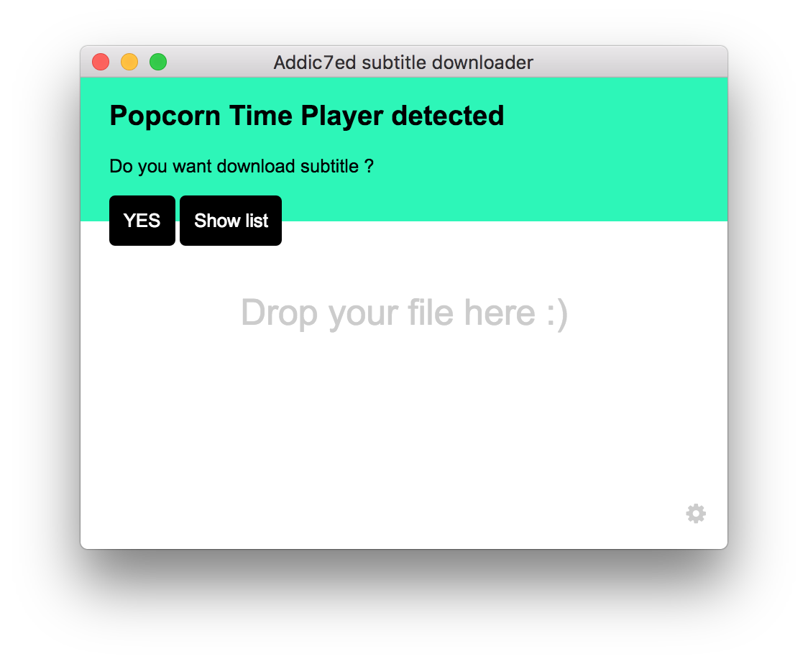

# Addic7ed bot
Drop your series to automatically get the correct subtitle from addic7ed.



## Releases
https://github.com/Jorand/addic7ed-bot/releases/

## Features
- Drop file directly on the app for download the correct subtitle from addic7ed.
- Popcorn Time feature, get addic7ed subtitle for the current playing Serie.

## Next/TODO
- Use electron-builder and auto-update
- Test intergation subtitlecat (https://github.com/mrmartin/mrmartin.github.io/blob/18c18636ecc2ea5150b827f3f11bae7004134f66/todo.md)

## Addic7ed useful url
`http://www.addic7ed.com/serie/<slug>/<season>/<episode>/<lang>`
Lang : 
0 = all
1 = English
8 = French

## Filename parser compatible with
- [torrent-name-parser](https://github.com/clems6ever/torrent-name-parser)

## To Use
First we need to install node.js. So go ahead and do that.

```bash
# Install dependencies
npm install
# Run the app
npm start

# Build the app for mac
npm run dist
```
